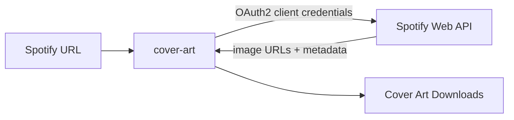

<div align="center">
  
</div>

<div align="center">


</div>

<br/>

Paste a Spotify track or album URL and get back every available resolution of its cover art as a direct download. The backend authenticates with the Spotify Web API using OAuth2 client credentials, parses the URL to determine whether it's a track or album, and returns the image set alongside the track name and artist. A minimal dark-themed UI is bundled and served by Spring Boot — no separate frontend server needed.

<br/>




<br/>


- **Track and album support** — parses Spotify URLs for both types and routes to the correct API endpoint
- **All image sizes** — returns every available resolution (640×640, 300×300, 64×64) with direct download links
- **Token caching** — OAuth2 access token is fetched once and cached in memory; auto-refreshed 60 seconds before expiry
- **Bundled web UI** — dark-themed frontend served as a Spring Boot static resource; no separate server or build step
- **URL sanitisation** — strips query parameters and trailing slashes before parsing, with validation on type and structure

<br/>


| Technology | Purpose |
|---|---|
| Java + Spring Boot | Application framework and static resource server |
| Spotify Web API | Source of cover art metadata and image URLs |
| OAuth2 client credentials | Stateless machine-to-machine auth with token caching |
| Vanilla HTML / CSS / JS | Bundled frontend — no build tooling required |

<br/>


Register an app at [developer.spotify.com](https://developer.spotify.com) to obtain a client ID and secret, then:

```bash
# 1. Clone
git clone https://github.com/psilde/cover-art.git
cd cover-art

# 2. Set credentials
export SPOTIFY_CLIENT_ID=your_client_id
export SPOTIFY_CLIENT_SECRET=your_client_secret

# 3. Run
./mvnw spring-boot:run
```

Open `http://localhost:8080` in your browser. No database required.

<br/>


| Method | Endpoint | Description |
|---|---|---|
| `GET` | `/api/cover?url={spotifyUrl}` | Fetch cover art for a Spotify track or album URL |

**Response:**
```json
{
  "name": "Album or track name",
  "artist": "Artist name",
  "type": "track",
  "images": [
    { "url": "https://...", "width": 640, "height": 640 },
    { "url": "https://...", "width": 300, "height": 300 },
    { "url": "https://...", "width": 64,  "height": 64  }
  ]
}
```
